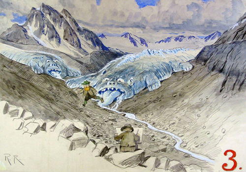

# BITE-Model: Bayesian Ice Thickness Estimation Model



Surging, biting Vernagtferner by R. Reschreiter (1911)

This model can be used to estimate ice thickness maps of mountain
glaciers and ice caps.  It needs surface elevation and a glacier
outline and can make use of the following additional data: surface
mass balance, elevation change, ice thickness measurements (usually
radar), and also expert guesses.  It uses a Bayesian framework
implemented numerically using a Markov chain Monte Carlo method.

## TOC

```@contents
Pages = [
    "data-loading.md",
    "forward.md",
    "inverse.md",
    "running.md",
    "api.md",
    "index-index.md",
]
Depth = 1
```
